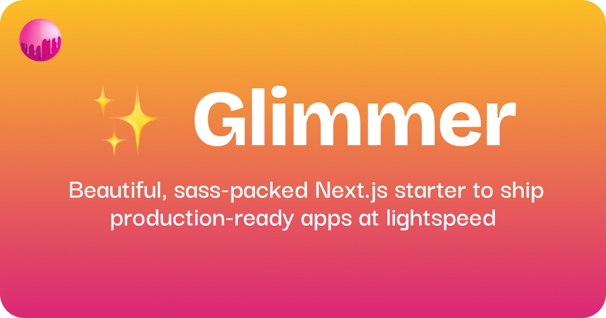

# ✨ Glimmer

Beautiful, sass-packed Next.js starter to ship production-ready apps at lightspeed – from the [sassywares](https://sassywares.com) team.

Compatible with Next.js 14.0.0+.

## [Features](./docs/features.md)

- i18n 🌐 with Next-Intl
- Tailwind 💅 w/Shadcn UI
- DDD 🍱 (Domain-Driven Design)
- Testing 🧪 Unit + E2E (Jest + Cypress)
- Bombshell 💣 ESLint + Prettier Configuration
- Fire 🔥 Data Fetching Utils (Axios + React Query + RSC)
- Dope 😎 Everyday Hooks (useMediaQuery, useLocalStorage, etc.)

Read more about the features [here](./docs/features.md).

## [Philosphy](./docs/philosophy.md)

- **Simplicity**: Keep it simple, stupid.
- **Sass**: Sassywares is all about sass, so we pack it in.
- **Speed**: Get up and running quickly.
- **Quality**: Ship production-ready apps.
- **DDD**: Domain-Driven Design is the way to go.

Read more about the philosophy [here](./docs/philosophy.md).

## Getting Started

Create a new repo using ✨ Glimmer as a template.

Then, it's just a Next.js app with a few extra goodies:

```bash

# Install dependencies
pnpm install

# Start the development server
pnpm dev

# Build for production
pnpm build

# Run the production build
pnpm start

# Run unit tests
pnpm test
pnpm test:watch

# Run E2E tests
pnpm e2e
pnpm e2e:watch

# Lint the codebase
pnpm lint

# Format the codebase
pnpm format

```

## Deployment

For now, I don't have any specifics on deployment, so I'm just gonna copy and paste the Next.js deployment docs here:

The easiest way to deploy your Next.js app is to use the [Vercel Platform](https://vercel.com/new?utm_medium=default-template&filter=next.js&utm_source=create-next-app&utm_campaign=create-next-app-readme) from the creators of Next.js.

Check out our [Next.js deployment documentation](https://nextjs.org/docs/deployment) for more details.

---

That wraps up ✨ Glimmer (so far), there is a lot more coming, please stay tuned and stay sassy!
